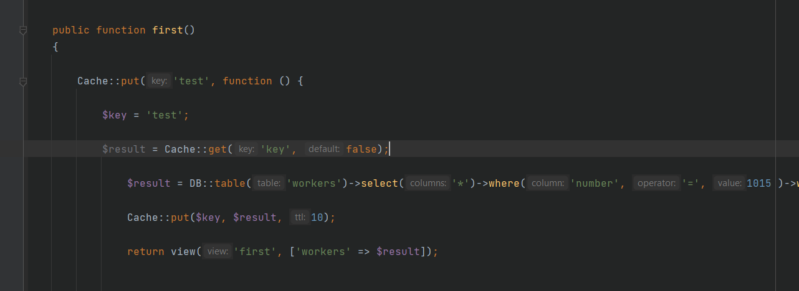
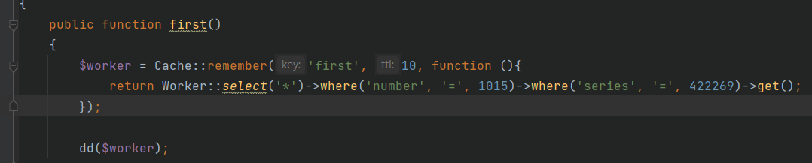

## Домашнее задание № 16.

- Первое, что я хотел установить это Redis, но окончательно запутался. Первое, что я сделал, это установил через команду composer require predis/predis, далее поменял настройки в cache.php и все, далее не понял, что у меня работает то в итоге.
- Второе, что я захотел попробовать установить Memcached, подключил через OpenSever, настройки в cache.php и дале не понятно...
- Третье, не совсем понятная деталь, побывал, как показано в вебинаре, но не понятно, закешировал ли я запрос или нет:
- 
- последнее, что я попробывал, все настройки вернул по умолчанию и сделал через file:

-Наглядно бы хотелось увидеть как оборачивать запросы в БД.

# Домашнее задание 16.

#### 1. Обернуть запросы в базу данных в кэш, используя обычный и тегированный кэши.

#### 2. Написать Artisan-команду, которая периодически очищает кэш.

 

 
